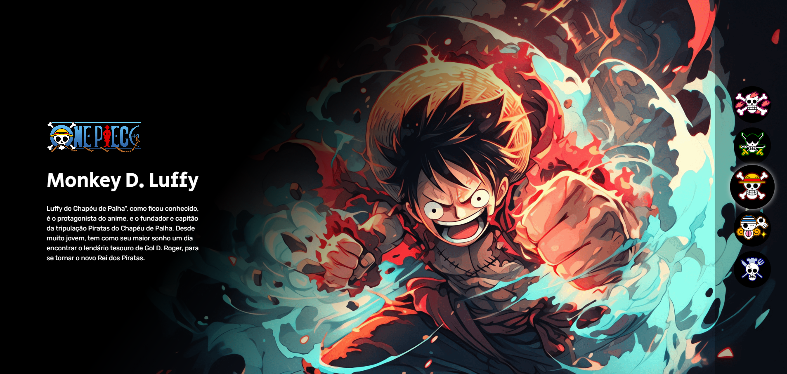
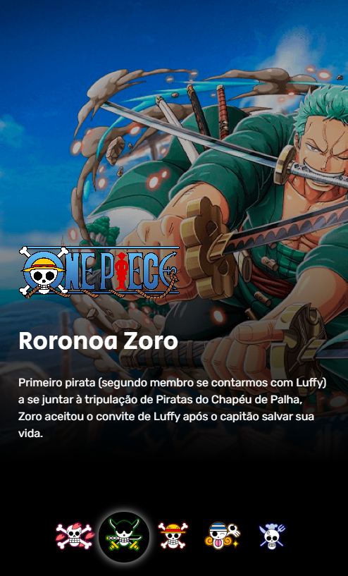

<h1 align="center">
  One Piece
</h1>

 

  
  

## ✨ Tecnologias

Esse projeto foi desenvolvido com as seguintes tecnologias:

## 💻 Projeto

O One Piece é um projeto responsivo com personagens do anime One Piece.
